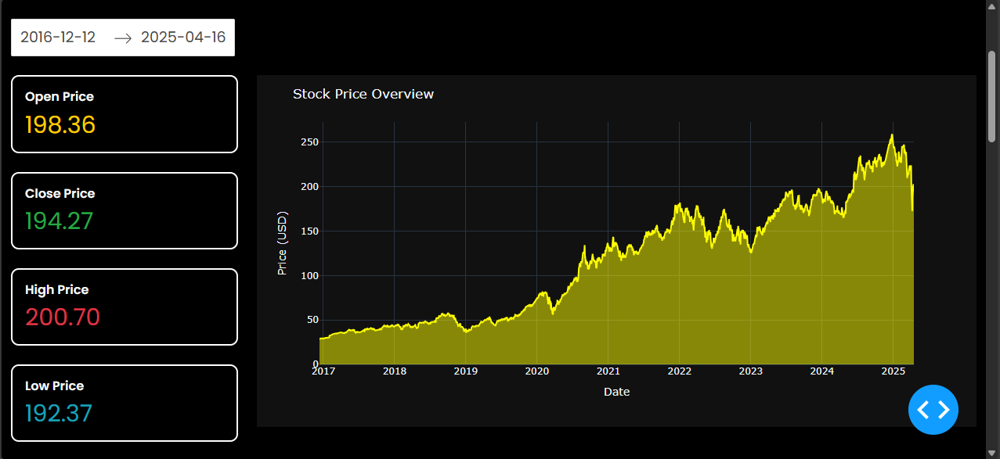

# stocks-market-interactive-dashboard

## Features
- **Interactive Visualizations**: Candlestick charts, Moving averages (50/100/200 days), Price trends (Open/Close/High/Low), Volatility analysis (30/90-day), Daily percentage change
- **Key Metrics**: Real-time Open/Close/High/Low prices, Volatility calculations, Daily percentage change
- **User Interface**: Drag-and-drop CSV upload, Date range selector, Dark theme

## Tech Stack
- Python 3, Dash, Plotly, Pandas, Dash Bootstrap Components
